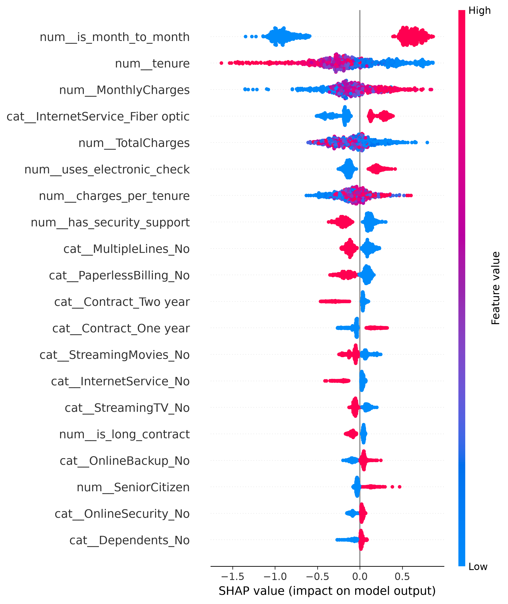
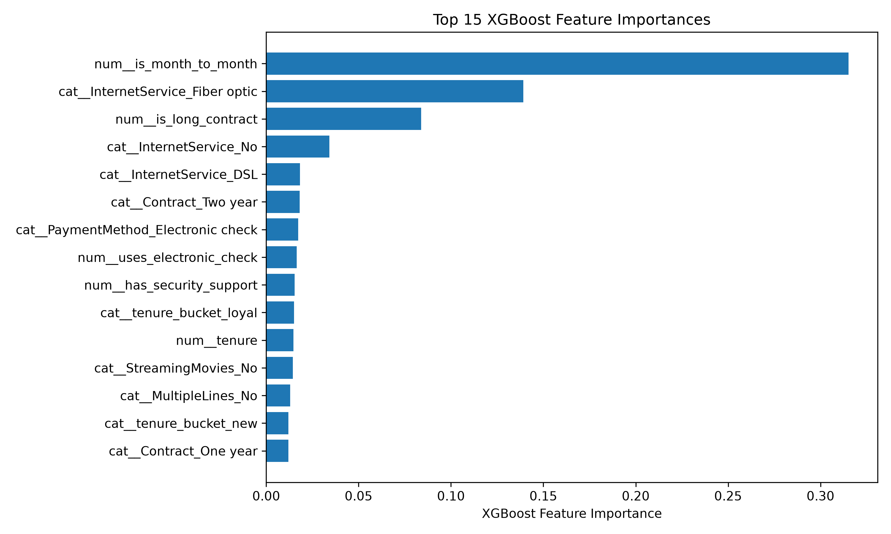

# Telco Customer Churn Prediction

## Problem Statement

Customer churn directly affects recurring revenue and customer lifetime value in telecom businesses. The goal of this project is to predict which customers are most likely to leave, explain the drivers behind churn risk, and translate those predictions into practical retention actions.

This project uses the IBM Telco Customer Churn dataset to build an end-to-end machine learning pipeline for churn prediction, model interpretation, and business-oriented retention analysis.

## Dataset Overview

The dataset used in this project is the IBM Telco Customer Churn dataset. Each row represents a telecom customer, and the columns include demographic information, subscribed services, billing details, contract type, payment method, and the target variable `Churn`.

This dataset is well suited for supervised classification because it contains a realistic mix of numerical and categorical features along with a business-relevant prediction target.

## Project Approach

The project was built as an end-to-end machine learning workflow:

- Data cleaning and preprocessing
- Feature engineering
- Model training and comparison
- Threshold tuning
- Explainability with SHAP
- Retention simulation
- Streamlit app for single-customer scoring

### Preprocessing

The preprocessing pipeline is designed to make the dataset clean, reproducible, and ready for machine learning. The raw data is first cleaned by fixing data types, converting numeric-like string columns into proper numeric format, and standardizing inconsistent service labels such as replacing `"No internet service"` with `"No"`.

After cleaning, the data is split into train, validation, and test sets using stratified sampling so the churn class balance is preserved across all splits. For model-ready preprocessing, a `ColumnTransformer` is used to handle mixed feature types. Numerical columns are imputed using the mean, categorical columns are imputed using the most frequent value, categorical features are one-hot encoded, and scaling can be applied for linear models when needed.

### Engineered Features

The following engineered features were created to better capture customer lifecycle, service adoption, contract risk, and billing behavior.

| Feature | Type | Description | Why it may help |
|---|---|---|---|
| `tenure_bucket` | Categorical | Groups customers by tenure into lifecycle stages such as new, mid-term, long-term, and loyal. | Newer customers often behave differently from long-term customers and may have higher churn risk. |
| `service_count` | Numerical | Counts the number of subscribed add-on services, excluding basic `PhoneService`. | Customers with more bundled services may show different retention behavior than customers with fewer services. |
| `is_month_to_month` | Binary | Indicates whether the customer is on a month-to-month contract. | Flexible contracts are often associated with higher churn risk. |
| `is_long_contract` | Binary | Indicates whether the customer has a one-year or two-year contract. | Longer contracts can signal stronger retention and lower churn risk. |
| `uses_electronic_check` | Binary | Indicates whether the customer uses electronic check as payment method. | Certain payment methods may correlate with weaker retention behavior. |
| `has_security_support` | Binary | Indicates whether the customer has either `OnlineSecurity` or `TechSupport`. | Security and support services may reflect stronger engagement and lower churn risk. |
| `charges_per_tenure` | Numerical | Approximates billing intensity by dividing `TotalCharges` by `tenure + 1`. | Captures the relationship between billing history and customer age. |
| `high_monthly_charges` | Binary | Flags customers whose monthly charges are above the dataset median. | Higher monthly charges can be associated with churn in telecom datasets. |

## Modeling

Three models were trained and compared on the processed data:

- Logistic Regression
- Random Forest
- XGBoost

Each model was evaluated using precision, recall, F1 score, ROC-AUC, PR-AUC, and confusion matrices. Because churn is an imbalanced classification problem, recall and precision-recall balance were treated as more informative than accuracy alone.

XGBoost was selected as the final model after threshold tuning because it provided the strongest balance between false positives and false negatives.

## Results

The final selected model for this project is XGBoost with a threshold of `0.4`. This threshold gave the best balance between identifying likely churners and limiting unnecessary retention outreach.

### Threshold Analysis

To better understand the tradeoff between false positives and false negatives, the XGBoost model was tested at multiple probability thresholds. Lower thresholds increased recall and reduced false negatives, while higher thresholds increased precision and reduced false positives.

| Threshold | False Positives | False Negatives | Precision | Recall | F1 |
|---|---:|---:|---:|---:|---:|
| 0.3 | 136 | 45 | 0.511 | 0.759 | 0.611 |
| 0.4 | 94 | 58 | 0.578 | 0.690 | 0.629 |
| 0.5 | 61 | 84 | 0.628 | 0.551 | 0.587 |
| 0.6 | 26 | 112 | 0.743 | 0.401 | 0.521 |

Based on validation performance, threshold `0.4` was selected as the main operating point because it offered the best overall balance for the project.

## Explainability

SHAP analysis was used to identify the most important drivers of churn and make the model easier to interpret.

### Top Churn Drivers

The strongest churn drivers were contract type, tenure, monthly charges, internet service type, and payment behavior. The most important feature by far was `is_month_to_month`, which suggests that customers on flexible contracts are much more likely to leave.

Shorter tenure also increased churn risk, while higher monthly charges and fiber optic internet were associated with higher churn likelihood. Other important drivers included `uses_electronic_check`, `charges_per_tenure`, and `has_security_support`, showing that billing preferences and support-related services also play an important role in retention.

The SHAP summary plot shows which features have the greatest impact on churn predictions and whether high or low values of those features increase or decrease churn risk.

## Business Insights

This project highlights a few clear business patterns:

- Customers on month-to-month contracts are the highest-risk retention segment.
- Short-tenure customers are more likely to churn and may benefit from stronger onboarding and early engagement.
- Higher monthly charges are associated with increased churn risk, suggesting that pricing and bundle strategy matter.
- Electronic check usage and lower support-related engagement may indicate weaker retention behavior.
- Churn prediction is most valuable when paired with threshold tuning and business cost assumptions rather than using a default 0.5 cutoff.

## Retention Simulation

A simple retention simulation was used to estimate the business value of different decision thresholds. For each threshold, the analysis calculated how many customers would be contacted, the total campaign cost, the expected number of churners saved, the expected recovered value, and the resulting net value.

Assumptions used in the simulation:

- Contact cost per customer = `$10`
- Save rate = `25%`
- Recovered value per saved churner = `$200`

| Threshold | Customers Contacted | Campaign Cost | Expected Saved Customers | Expected Recovered Value | Net Value |
|---|---:|---:|---:|---:|---:|
| 0.3 | 259 | 2590 | 36.5 | 7300.0 | 4710.0 |
| 0.4 | 191 | 1910 | 28.75 | 5750.0 | 3840.0 |
| 0.5 | 134 | 1340 | 21.75 | 4350.0 | 3010.0 |
| 0.6 | 97 | 970 | 17.0 | 3400.0 | 2430.0 |

The simulation showed that threshold `0.3` produced the highest expected net value, while threshold `0.4` offered a strong balance between expected profit and the number of customers targeted. For this project, threshold `0.4` was selected as the more practical operating point because it still delivers strong expected value while reducing campaign workload.

## App Demo

A lightweight Streamlit app was built to score a single customer and display:

- churn probability,
- predicted churn class,
- risk label,
- top churn drivers,
- suggested retention action.

This app demonstrates how the trained model can be turned into a simple decision-support tool for business users.

## Screenshots

### Streamlit App

### SHAP Summary Plot

### Feature Importance Plot

